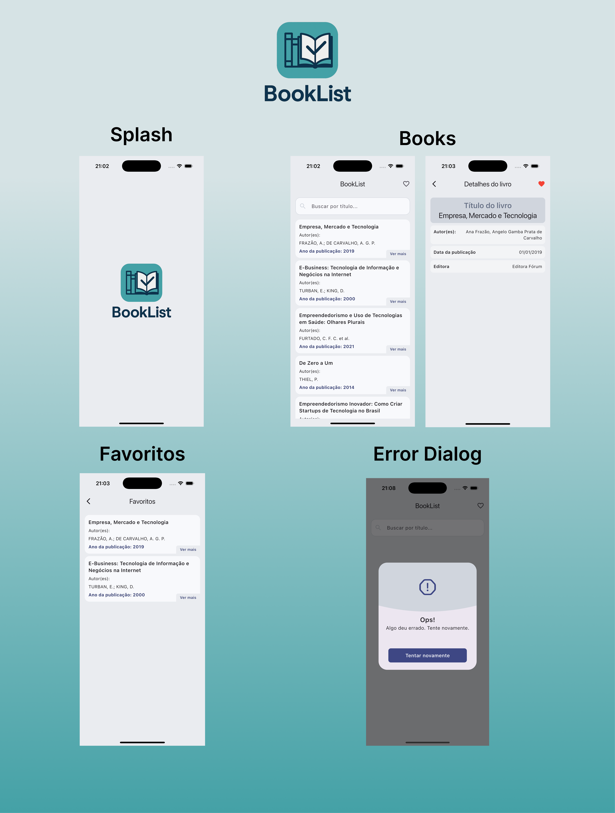

# 📍 BookList

Aplicativo Flutter para listagem de livros via **API**, com **cache local usando SharedPreferences**.

### 🔹 Screenshot

<p align="center">
   
</p>


## 🚀 Funcionalidades

- Busca livros e pode fazer filtros por nome do livro utilizando a API [ViaCEP](https://681d018ff74de1d219ae8534.mockapi.io/api/v1/books).
- Armazena no cache local os livros marcados como favorito ****.
- É possivel filtrar a lista de livros através do campo de busca
- Estrutura organizada em **Clean Architecture** (Data / Domain / Presentation).
- Gerenciamento de estado com **Cubit (Bloc)**.

## 🏗️ Arquitetura

```
lib/
 ├── core/             # Configurações, Theme, Network e utilitários
 ├── ds/               # Design System (temas, tokens, componentes)
 ├── features/
 │    └── books/  # Módulo de consulta de livros 
 │        ├── data/        # Datasources (API) + Repository Impl
 │        ├── domain/      # Entidades, Repositórios (contratos), Usecases
 │        ├── presentation/ # Cubits e Páginas
 │            ├── factories/ # Injeção de dependências  

        ...
 └── main.dart
```


## 📦 Dependências principais

- [flutter_bloc](https://pub.dev/packages/flutter_bloc) – Gerenciamento de estado  
- [equatable](https://pub.dev/packages/equatable) – Comparação de estados/entidades  
- [shared_preferences](https://pub.dev/packages/shared_preferences) – Cache  
- [http](https://pub.dev/packages/dio) – Requisições à API  

## ▶️ Execução

Utilizar a versão 3.35.4 do Flutter

```bash
flutter pub get
flutter run
```
